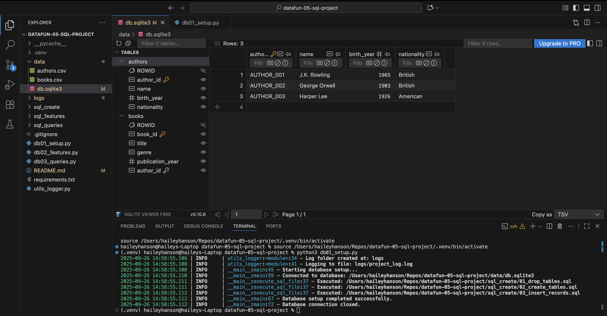
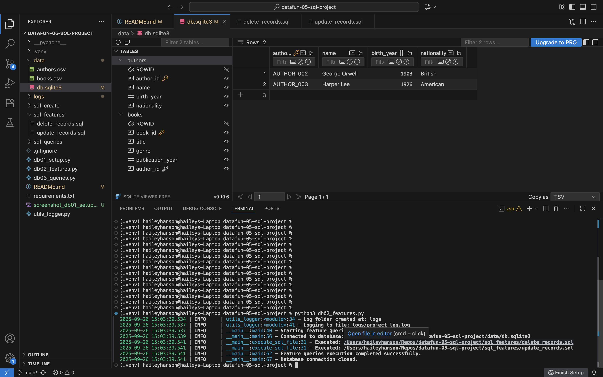
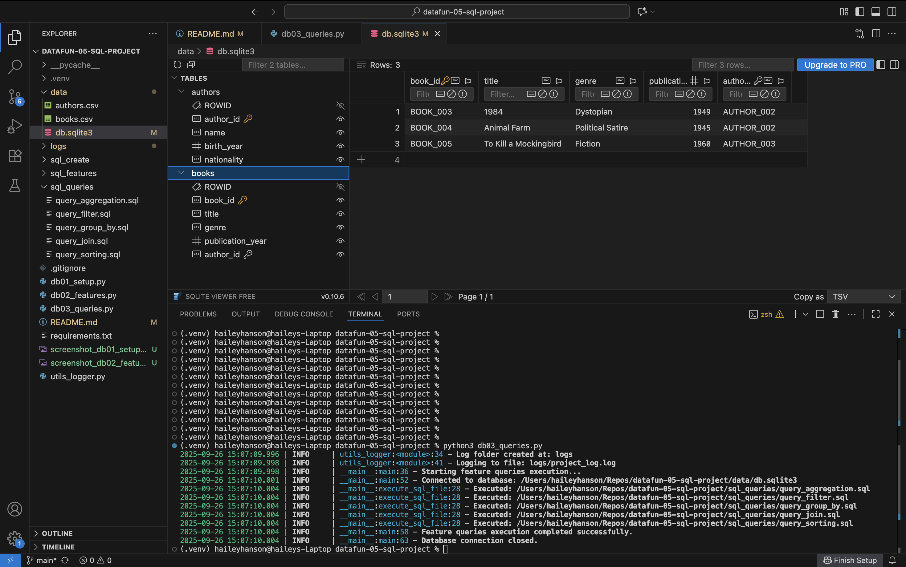

# datafun-05-sql-project
Using Python and SQL to work with well-structured, relational data to demonstrate the core competencies and skills associated with basic SQL. Part of the Data Analytics Fundamentals Graduate-level course at Northwest Missouri State University

# Specification for Project 5 SQL Module

## Overview

Project 5 integrates Python and SQL,
focusing on database interactions using SQLite.
The project involves creating and managing a database, building a schema, and performing various SQL operations,
including queries with joins, filters, and aggregations.

---

## Step 1: Clone Repository 
git clone https://github.com/haileylhanson/datafun-05-sql-project
cd datafun-05-sql-project

---

## Step 2: Create & Activate Virtual Environment 

Mac or Linux: python3 -m venv .venv source .venv/bin/activate
Windows PowerShell: python3 -m venv .venv .venv\Scripts\Activate

---

## Step 3: Install Dependencies

pip install --upgrade pip
pip install -r requirements.txt

---

## Step 4: Run Setup Script

python3 db01_setup.py

---

## Step 5: Run Features Script

python3 db02_features.py

---

## Step 6: Run Queries Script

python3 db03_queries.py

---
